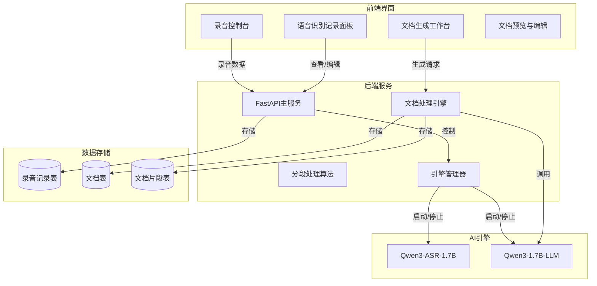
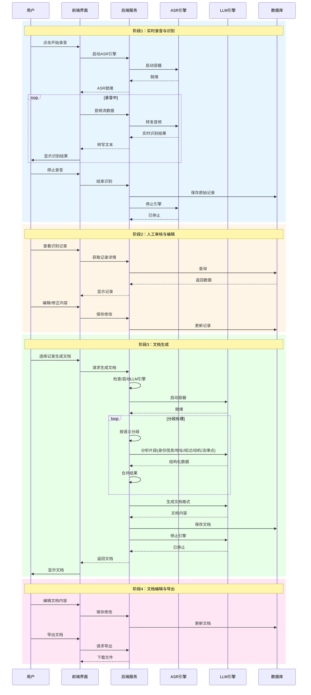

# 智能文档生成系统 - 完整架构设计

## 1. 系统概述

### 1.1 业务场景
- **参与方**：记录人员 + 当事人
- **输入**：ASR语音识别记录全部对话（约10000字）
- **输出**：标准格式的文档记录
- **流程**：录音 → 语音识别 → 人工审核 → LLM提炼 → 生成文档

### 1.2 技术约束
- **GPU**: RTX 5060 Ti 8GB
- **ASR模型**: Qwen3-ASR-1.7B（已部署）
- **LLM模型**: Qwen3-1.7B（需要切换）
- **上下文限制**: 256-2048 tokens
- **ASR和LLM互斥运行**

---

## 2. 系统架构

### 2.1 整体架构图



### 2.2 数据流设计



---

## 3. 分段处理算法设计

### 3.1 核心问题
- 输入：约10000字的对话文本
- 限制：LLM上下文 256-2048 tokens
- 目标：完整提取身份信息、地址、事情经过、动机、要点

### 3.2 分段策略

#### 3.2.1 两级分段架构

```
┌─────────────────────────────────────────────────────────────┐
│                    原始对话文本 (~10000字)                      │
└─────────────────────────────────────────────────────────────┘
                              ↓
┌─────────────────────────────────────────────────────────────┐
│  第一层：语义分段（按对话轮次和主题切分）                          │
│  ├─ 片段1: 开场与身份确认 (~800字)                              │
│  ├─ 片段2: 事情经过 - 起因部分 (~1200字)                        │
│  ├─ 片段3: 事情经过 - 经过部分 (~1500字)                        │
│  ├─ 片段4: 事情经过 - 结果部分 (~1000字)                        │
│  ├─ 片段5: 动机与态度 (~800字)                                 │
│  └─ 片段6: 补充问答 (~700字)                                   │
└─────────────────────────────────────────────────────────────┘
                              ↓
┌─────────────────────────────────────────────────────────────┐
│  第二层：LLM处理分段（适配上下文限制）                            │
│  每片段若超长，进一步按句子切分，逐段分析后合并                      │
└─────────────────────────────────────────────────────────────┘
```

#### 3.2.2 分段处理算法

```python
# 伪代码：分段处理算法
class DocumentProcessor:
    MAX_TOKENS_PER_CHUNK = 1500  # 预留空间给输出
    
    def process_large_document(self, full_text: str) -> Dict:
        # Step 1: 语义分段
        semantic_chunks = self.semantic_segmentation(full_text)
        
        # Step 2: 对每个语义片段进行分析
        extracted_info = {
            "identities": [],
            "addresses": [],
            "events": [],
            "motivations": [],
            "legal_points": []
        }
        
        for chunk in semantic_chunks:
            # 检查是否需要进一步切分
            if self.estimate_tokens(chunk) > self.MAX_TOKENS_PER_CHUNK:
                sub_chunks = self.sentence_level_segmentation(chunk)
                for sub in sub_chunks:
                    partial_result = self.call_llm_extractor(sub)
                    extracted_info = self.merge_extracted_info(extracted_info, partial_result)
            else:
                partial_result = self.call_llm_extractor(chunk)
                extracted_info = self.merge_extracted_info(extracted_info, partial_result)
        
        # Step 3: 去重与整合
        extracted_info = self.deduplicate_and_integrate(extracted_info)
        
        # Step 4: 生成文档
        record = self.generate_document(extracted_info)
        
        return record
```

#### 3.2.3 语义分段规则

| 分段类型 | 识别特征 | 处理策略 |
|---------|---------|---------|
| 身份确认段 | 姓名、证件号、职业 | 高优先级，完整提取 |
| 地址信息段 | 居住地址、联系地址 | 地址标准化处理 |
| 事情经过段 | 时间、地点、人物、行为 | 按时间顺序拼接 |
| 动机态度段 | 为什么、目的、态度 | 情感分析辅助 |
| 要点段 | 相关术语、条款 | 关键词提取 |

### 3.3 LLM Prompt设计

#### 3.3.1 信息提取Prompt

```
你是一名专业的文档分析助手。请从以下对话内容中提取关键信息，并以JSON格式返回。

对话内容：
{text_chunk}

请提取以下信息：
{
  "identities": [
    {
      "role": "记录人/当事人/证人",
      "name": "姓名",
      "id_card": "证件号",
      "occupation": "职业",
      "other_info": "其他身份信息"
    }
  ],
  "addresses": [
    {
      "type": "居住地址/联系地址/地址",
      "address": "详细地址"
    }
  ],
  "events": [
    {
      "time": "时间",
      "location": "地点",
      "people": "涉及人员",
      "action": "具体行为",
      "result": "结果"
    }
  ],
  "motivations": [
    "动机描述"
  ],
  "legal_points": [
    {
      "term": "术语/条款",
      "context": "相关上下文"
    }
  ]
}

注意：
1. 只返回JSON格式数据，不要其他说明
2. 如某类信息不存在，返回空数组
3. 时间请标准化为24小时制
4. 地址请保留完整信息
```

#### 3.3.2 文档生成Prompt

```
你是一名专业的文档制作助手。请根据以下结构化信息，生成一份标准的文档记录。

文档信息：
- 文档编号：{record_number}
- 记录时间：{start_time} 至 {end_time}
- 记录地点：{location}
- 记录人：{officer_names}
- 审核人：{recorder_name}
- 当事人：{person_info}

提取的信息：
{extracted_info_json}

请按以下格式生成文档：

================================================================
                     文档记录
文档编号：{record_number}

记录时间：{start_time} 至 {end_time}
记录地点：{location}
记录人：{officer_names}    审核人：{recorder_name}

当事人：{person_name}，性别：{gender}，民族：{ethnicity}，
出生日期：{birth_date}，证件号码：{id_card}，
联系地址：{registered_address}，现住址：{current_address}，
工作单位：{work_unit}，联系方式：{phone}

问：我们是{organization}的工作人员，现依法向您询问，请您如实回答，不得隐瞒、歪曲事实。您听明白了吗？
答：听明白了。

问：您的身份信息是否属实？
答：属实。

问：请把事情的经过详细说一下。
答：{event_narrative}

[继续根据提取的信息生成问答...]

问：您还有什么要补充的吗？
答：没有了。

问：以上记录您看一下，与您所说的是否一致？
答：一致。

当事人（签名）：__________
记录人（签名）：__________    审核人（签名）：__________
================================================================

要求：
1. 严格按照标准文档格式
2. 问答要符合逻辑顺序
3. 时间、地点、人物信息要准确
4. 语言规范，使用书面语
```

---

## 4. 前端页面结构设计

### 4.1 页面布局

```
┌──────────────────────────────────────────────────────────────────────┐
│  导航栏: 智能文档生成系统 v3.0                              [用户]    │
├──────────────────────────────────────────────────────────────────────┤
│                                                                      │
│  ┌────────────────────────────────────────────────────────────────┐ │
│  │  引擎状态面板                                                   │ │
│  │  ┌─────────────┐    ┌─────────────┐    ┌─────────────┐         │ │
│  │  │  ASR引擎     │    │  LLM引擎     │    │  GPU状态     │         │ │
│  │  │  [启动/停止] │    │  [启动/停止] │    │  6GB/8GB    │         │ │
│  │  └─────────────┘    └─────────────┘    └─────────────┘         │ │
│  └────────────────────────────────────────────────────────────────┘ │
│                                                                      │
│  ┌──────────────────────────────┐  ┌──────────────────────────────┐ │
│  │  标签页导航                    │  │                              │ │
│  │  [实时录音] [记录管理] [文档工作台] │                              │ │
│  └──────────────────────────────┘  └──────────────────────────────┘ │
│                                                                      │
│  ═══════════════════════════════════════════════════════════════════ │
│  标签页内容区域                                                        │
│  ═══════════════════════════════════════════════════════════════════ │
│                                                                      │
│  ┌────────────────────────────────────────────────────────────────┐ │
│  │  【实时录音】标签页                                              │ │
│  │                                                                  │ │
│  │  ┌──────────────────────┐    ┌──────────────────────────────┐  │ │
│  │  │   [开始录音]          │    │  实时识别结果                 │  │ │
│  │  │   [停止录音]          │    │  ─────────────────────────   │  │ │
│  │  │   [暂停/继续]         │    │  记录人A：你叫什么名字？        │  │ │
│  │  │                       │    │  当事人：我叫张三。           │  │ │
│  │  │   录音时长: 00:05:32   │    │  记录人B：证件号报一下。      │  │ │
│  │  │   识别字数: 1,250字    │    │  ...                         │  │ │
│  │  └──────────────────────┘    └──────────────────────────────┘  │ │
│  │                                                                  │ │
│  │  [保存记录并结束]  [放弃录音]                                    │ │
│  └────────────────────────────────────────────────────────────────┘ │
│                                                                      │
│  ┌────────────────────────────────────────────────────────────────┐ │
│  │  【记录管理】标签页                                              │ │
│  │                                                                  │ │
│  │  搜索: [________________]  [筛选]  [排序]                        │ │
│  │  ─────────────────────────────────────────────────────────────  │ │
│  │  ┌──────────────────────────────────────────────────────────┐  │ │
│  │  │ ▶ 2024-01-15 14:30  记录 - 张三                  │  │ │
│  │  │   时长: 32分钟  字数: 8,500  状态: [已生成文档]            │  │ │
│  │  │   [查看详情] [编辑原文] [生成文档] [删除]                  │  │ │
│  │  ├──────────────────────────────────────────────────────────┤  │ │
│  │  │ ▶ 2024-01-14 09:15  记录 - 李四                  │  │ │
│  │  │   时长: 15分钟  字数: 3,200  状态: [待生成文档]            │  │ │
│  │  └──────────────────────────────────────────────────────────┘  │ │
│  └────────────────────────────────────────────────────────────────┘ │
│                                                                      │
│  ┌────────────────────────────────────────────────────────────────┐ │
│  │  【文档工作台】标签页                                            │ │
│  │                                                                  │ │
│  │  ┌──────────────────────────────────────────────────────────┐  │ │
│  │  │ 文档列表                                                   │  │ │
│  │  ├──────────────────────────────────────────────────────────┤  │ │
│  │  │ ▶ 张三文档记录                              [草稿] [编辑]  │  │ │
│  │  │ ▶ 李四文档记录                              [已生成] [导出]│  │ │
│  │  └──────────────────────────────────────────────────────────┘  │ │
│  │                                                                  │ │
│  │  [新建文档] [批量导出]                                          │ │
│  └────────────────────────────────────────────────────────────────┘ │
│                                                                      │
└──────────────────────────────────────────────────────────────────────┘
```

### 4.2 组件设计

#### 4.2.1 引擎控制卡片

```
┌─────────────────────────┐
│ ● ASR引擎      [离线]   │
│ qwen3-asr-1.7b          │
│ 语音识别转文字           │
│                         │
│ [启动服务]              │
└─────────────────────────┘
```

#### 4.2.2 文档预览/编辑组件

```
┌─────────────────────────────────────────────────────────────┐
│ 文档预览/编辑                                      [X]       │
├─────────────────────────────────────────────────────────────┤
│                                                              │
│  文档编号：DOC-20240115-001                                  │
│  状态：[已提取] → [生成中...] → [已生成]                     │
│                                                              │
│  ┌──────────────────────┐  ┌────────────────────────────┐  │
│  │ 原始转写文本          │  │ 生成的文档内容              │  │
│  │ ───────────────────  │  │ ─────────────────────────  │  │
│  │ 记录人：姓名？        │  │ 文档记录                    │  │
│  │ 当事人：张三          │  │ ──────────────────         │  │
│  │ 记录人：证件号？      │  │ 时间：2024年1月15日...      │  │
│  │ ...                  │  │ ...                        │  │
│  └──────────────────────┘  └────────────────────────────┘  │
│                                                              │
│  [重新提取] [重新生成] [保存] [导出Word] [导出PDF]          │
│                                                              │
└─────────────────────────────────────────────────────────────┘
```

---

## 5. 后端API设计

### 5.1 核心接口

| 方法 | 路径 | 功能 | 引擎 |
|------|------|------|------|
| POST | `/api/asr/start` | 启动ASR引擎 | ASR |
| POST | `/api/asr/stop` | 停止ASR引擎 | ASR |
| WS | `/ws/transcribe` | 实时语音识别 | ASR |
| POST | `/api/llm/start` | 启动LLM引擎 | LLM |
| POST | `/api/llm/stop` | 停止LLM引擎 | LLM |
| POST | `/api/records` | 创建新文档 | LLM |
| GET | `/api/records/{id}` | 获取文档详情 | - |
| POST | `/api/records/{id}/extract` | 信息提取 | LLM |
| POST | `/api/records/{id}/generate` | 生成文档 | LLM |
| PUT | `/api/records/{id}` | 更新文档 | - |
| DELETE | `/api/records/{id}` | 删除文档 | - |

### 5.2 引擎管理接口

```python
# 引擎状态查询
GET /api/engine/status

# 响应
{
  "asr": {
    "status": "ready",      # ready/offline/starting/stopping/error
    "model": "qwen3-asr-1.7b",
    "gpu_memory_mb": 4096
  },
  "llm": {
    "status": "offline",
    "model": "qwen3-1.7b",
    "gpu_memory_mb": 0
  }
}

# 引擎控制
POST /api/engine/{asr|llm}/start
POST /api/engine/{asr|llm}/stop
```

---

## 6. 数据库设计

### 6.1 表结构

```sql
-- 转写记录表
CREATE TABLE transcriptions (
    id INTEGER PRIMARY KEY AUTOINCREMENT,
    user_id INTEGER,
    title TEXT,
    audio_path TEXT,
    text TEXT,
    language TEXT,
    duration_seconds REAL,
    created_at TIMESTAMP DEFAULT CURRENT_TIMESTAMP,
    FOREIGN KEY (user_id) REFERENCES users (id)
);

-- 文档记录表
CREATE TABLE document_records (
    id INTEGER PRIMARY KEY AUTOINCREMENT,
    transcription_id INTEGER,
    title TEXT NOT NULL,
    status TEXT DEFAULT 'draft',  -- draft/extracting/extracted/generating/generated/completed/error
    extracted_info TEXT,          -- JSON格式提取的信息
    record_content TEXT,          -- 生成的文档内容
    created_at TIMESTAMP DEFAULT CURRENT_TIMESTAMP,
    updated_at TIMESTAMP DEFAULT CURRENT_TIMESTAMP,
    FOREIGN KEY (transcription_id) REFERENCES transcriptions (id)
);

-- 文档片段表（用于分段处理中间结果）
CREATE TABLE document_fragments (
    id INTEGER PRIMARY KEY AUTOINCREMENT,
    record_id INTEGER,
    fragment_index INTEGER,
    raw_text TEXT,
    extracted_info TEXT,
    status TEXT DEFAULT 'pending',  -- pending/processing/completed/error
    created_at TIMESTAMP DEFAULT CURRENT_TIMESTAMP,
    FOREIGN KEY (record_id) REFERENCES document_records (id)
);
```

---

## 7. 性能优化策略

### 7.1 GPU资源管理

```python
# 引擎互斥锁
class EngineManager:
    def __init__(self):
        self.active_engine = None  # 'asr' | 'llm' | None
        self.gpu_lock = asyncio.Lock()
    
    async def start_engine(self, engine_type: str):
        async with self.gpu_lock:
            if self.active_engine == engine_type:
                return True
            
            # 停止当前引擎
            if self.active_engine:
                await self.stop_engine(self.active_engine)
            
            # 启动新引擎
            success = await self._do_start(engine_type)
            if success:
                self.active_engine = engine_type
            return success
```

### 7.2 分段处理优化

- **语义预分段**：按对话主题预先分段，减少LLM调用次数
- **并行处理**：独立的语义片段可并行调用LLM
- **结果缓存**：已处理片段缓存，避免重复处理
- **增量更新**：编辑后仅重新处理变更片段

### 7.3 前端优化

- **懒加载**：历史记录分页加载
- **虚拟滚动**：大量记录时保持流畅
- **WebSocket重连**：自动重连机制
- **渐进式显示**：长文档分段显示

---

## 8. 部署架构

### 8.1 Docker Compose配置

```yaml
version: '3.8'

services:
  # 主应用服务
  app:
    build: .
    ports:
      - "8080:8080"
    volumes:
      - ./data:/app/data
      - ./models:/app/models:ro
    environment:
      - DATABASE_PATH=/app/data/intelligent_document.db
      - ASR_API_URL=http://localhost:8001
      - LLM_API_URL=http://localhost:8002
    depends_on:
      - asr
      - llm

  # ASR引擎服务
  asr:
    build:
      context: .
      dockerfile: Dockerfile.asr
    ports:
      - "8001:8000"
    volumes:
      - ./models/Qwen3-ASR-1.7B:/app/model:ro
    deploy:
      resources:
        reservations:
          devices:
            - driver: nvidia
              count: 1
              capabilities: [gpu]

  # LLM引擎服务
  llm:
    build:
      context: .
      dockerfile: Dockerfile.llm
    ports:
      - "8002:8000"
    volumes:
      - ./models/Qwen3-1.7B:/app/model:ro
    deploy:
      resources:
        reservations:
          devices:
            - driver: nvidia
              count: 1
              capabilities: [gpu]
```

### 8.2 资源分配建议

| 组件 | GPU显存 | CPU | 内存 | 说明 |
|------|---------|-----|------|------|
| ASR引擎 | 4-6GB | 2核 | 4GB | 运行时独占 |
| LLM引擎 | 6-8GB | 2核 | 8GB | 运行时独占 |
| 主应用 | - | 1核 | 2GB | 始终运行 |
| 合计 | 8GB | 5核 | 14GB | 互斥运行最优 |

---

## 9. 错误处理与监控

### 9.1 错误分类

| 错误类型 | 处理策略 | 用户提示 |
|---------|---------|---------|
| ASR识别错误 | 重试3次，失败后停止 | "语音识别暂时不可用，请重试" |
| LLM生成错误 | 分段重试，记录失败片段 | "文档生成部分失败，请查看详情" |
| GPU内存不足 | 自动停止其他引擎 | "GPU内存不足，正在调整资源..." |
| 网络超时 | 指数退避重试 | "连接超时，正在重试..." |

### 9.2 日志设计

```python
# 结构化日志
{
    "timestamp": "2024-01-15T14:30:00Z",
    "level": "INFO",
    "component": "document_processor",
    "event": "chunk_processing_complete",
    "data": {
        "record_id": 123,
        "chunk_index": 2,
        "tokens_in": 1450,
        "tokens_out": 320,
        "duration_ms": 2500
    }
}
```

---

## 10. 安全与合规

### 10.1 数据安全

- 本地部署，数据不出境
- 敏感信息脱敏存储
- 访问日志审计
- 定期备份策略

### 10.2 权限控制

```python
# 简化的RBAC
class Permission:
    VIEW_RECORDS = "view_records"
    EDIT_RECORDS = "edit_records"
    DELETE_RECORDS = "delete_records"
    EXPORT_RECORDS = "export_records"
    MANAGE_ENGINES = "manage_engines"

ROLES = {
    "admin": [Permission.ALL],
    "operator": [
        Permission.VIEW_RECORDS,
        Permission.EDIT_RECORDS,
        Permission.EXPORT_RECORDS
    ],
    "viewer": [Permission.VIEW_RECORDS]
}
```

---

## 11. 未来扩展

### 11.1 功能扩展

- [ ] 多语言支持（英文、方言）
- [ ] 实时协作编辑
- [ ] 语音合成功能（TTS）
- [ ] 自动摘要生成
- [ ] 敏感信息自动脱敏
- [ ] 文档模板自定义

### 11.2 性能扩展

- [ ] 支持更大模型（7B、14B）
- [ ] 多GPU并行处理
- [ ] 分布式部署
- [ ] 模型量化优化

---

## 12. 总结

本系统设计围绕"**低资源占用、高处理效率、简单易用**"三个核心目标：

1. **资源优化**：通过引擎互斥运行，8GB显存即可流畅运行
2. **智能分段**：独创两级分段算法，突破上下文长度限制
3. **用户友好**：Web界面一站式操作，无需命令行

系统采用模块化设计，便于后续功能扩展和性能升级。
