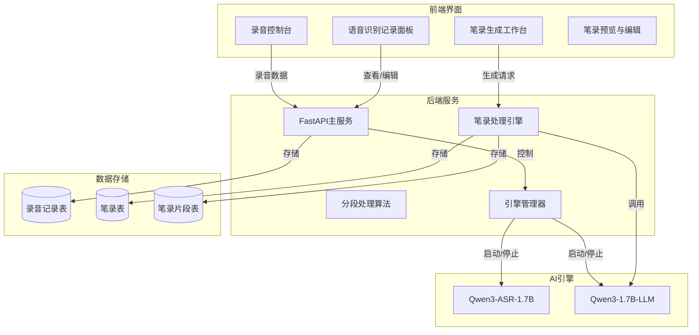
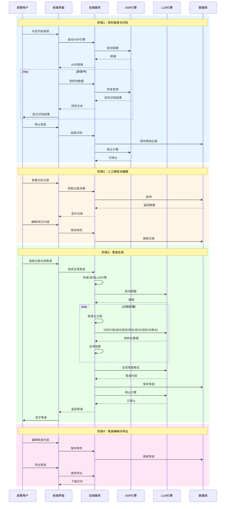
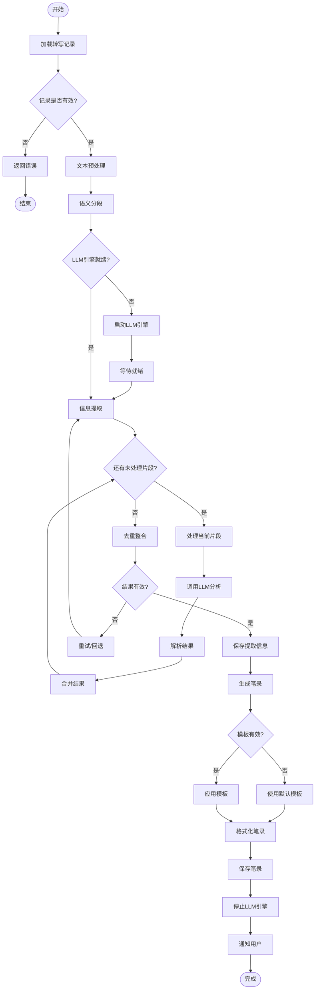
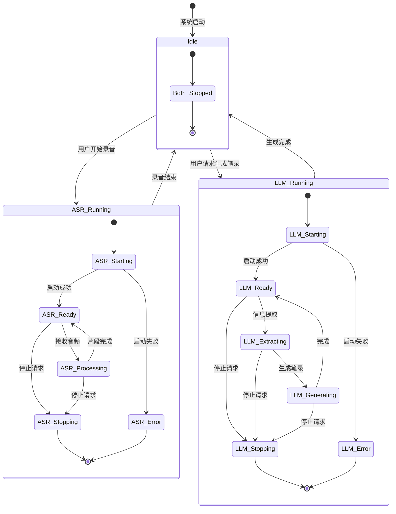

# 智能文档生成系统 - 完整架构设计

## 1. 系统概述

### 1.1 业务场景
- **参与方**：记录人员 + 当事人
- **输入**：ASR语音识别记录全部对话（约10000字）
- **输出**：标准格式的文档记录
- **流程**：录音 → 语音识别 → 人工审核 → LLM提炼 → 生成文档

### 1.2 技术约束
- **GPU**: RTX 5060 Ti 8GB
- **ASR模型**: Qwen3-ASR-1.7B（已部署）
- **LLM模型**: Qwen3-1.7B（需要切换）
- **上下文限制**: 256-2048 tokens
- **ASR和LLM互斥运行**

---

## 2. 系统架构

### 2.1 整体架构图



### 2.2 数据流设计



---

## 3. 分段处理算法设计

### 3.1 核心问题
- 输入：约10000字的对话文本
- 限制：LLM上下文 256-2048 tokens
- 目标：完整提取身份信息、住址、事情经过、动机、法律要点

### 3.2 分段策略

#### 3.2.1 两级分段架构

```
┌─────────────────────────────────────────────────────────────┐
│                    原始对话文本 (~10000字)                      │
└─────────────────────────────────────────────────────────────┘
                              ↓
┌─────────────────────────────────────────────────────────────┐
│  第一层：语义分段（按对话轮次和主题切分）                          │
│  ├─ 片段1: 开场与身份确认 (~800字)                              │
│  ├─ 片段2: 事情经过 - 起因部分 (~1200字)                        │
│  ├─ 片段3: 事情经过 - 经过部分 (~1500字)                        │
│  ├─ 片段4: 事情经过 - 结果部分 (~1000字)                        │
│  ├─ 片段5: 动机与态度 (~800字)                                 │
│  └─ 片段6: 补充问答 (~700字)                                   │
└─────────────────────────────────────────────────────────────┘
                              ↓
┌─────────────────────────────────────────────────────────────┐
│  第二层：LLM处理分段（适配上下文限制）                            │
│  每片段若超长，进一步按句子切分，逐段分析后合并                      │
└─────────────────────────────────────────────────────────────┘
```

#### 3.2.2 分段处理算法

```python
# 伪代码：分段处理算法
class DocumentProcessor:
    MAX_TOKENS_PER_CHUNK = 1500  # 预留空间给输出
    
    def process_large_document(self, full_text: str) -> Dict:
        # Step 1: 语义分段
        semantic_chunks = self.semantic_segmentation(full_text)
        
        # Step 2: 对每个语义片段进行分析
        extracted_info = {
            "identities": [],
            "addresses": [],
            "events": [],
            "motivations": [],
            "legal_points": []
        }
        
        for chunk in semantic_chunks:
            # 检查是否需要进一步切分
            if self.estimate_tokens(chunk) > self.MAX_TOKENS_PER_CHUNK:
                sub_chunks = self.sentence_level_segmentation(chunk)
                for sub in sub_chunks:
                    partial_result = self.call_llm_extractor(sub)
                    extracted_info = self.merge_extracted_info(extracted_info, partial_result)
            else:
                partial_result = self.call_llm_extractor(chunk)
                extracted_info = self.merge_extracted_info(extracted_info, partial_result)
        
        # Step 3: 去重与整合
        extracted_info = self.deduplicate_and_integrate(extracted_info)
        
        # Step 4: 生成笔录
        record = self.generate_police_record(extracted_info)
        
        return record
```

#### 3.2.3 语义分段规则

| 分段类型 | 识别特征 | 处理策略 |
|---------|---------|---------|
| 身份确认段 | 姓名、身份证号、职业 | 高优先级，完整提取 |
| 住址信息段 | 居住地址、户籍地址 | 地址标准化处理 |
| 事情经过段 | 时间、地点、人物、行为 | 按时间顺序拼接 |
| 动机态度段 | 为什么、目的、态度 | 情感分析辅助 |
| 法律要点段 | 法律术语、罪名、条款 | 关键词提取 |

### 3.3 LLM Prompt设计

#### 3.3.1 信息提取Prompt

```
你是一名专业的公安笔录分析助手。请从以下对话内容中提取关键信息，并以JSON格式返回。

对话内容：
{text_chunk}

请提取以下信息：
{
  "identities": [
    {
      "role": "民警/嫌疑人/证人",
      "name": "姓名",
      "id_card": "身份证号",
      "occupation": "职业",
      "other_info": "其他身份信息"
    }
  ],
  "addresses": [
    {
      "type": "居住地址/户籍地址/案发地址",
      "address": "详细地址"
    }
  ],
  "events": [
    {
      "time": "时间",
      "location": "地点",
      "people": "涉及人员",
      "action": "具体行为",
      "result": "结果"
    }
  ],
  "motivations": [
    "动机描述"
  ],
  "legal_points": [
    {
      "term": "法律术语/罪名",
      "context": "相关上下文"
    }
  ]
}

注意：
1. 只返回JSON格式数据，不要其他说明
2. 如某类信息不存在，返回空数组
3. 时间请标准化为24小时制
4. 地址请保留完整省市区信息
```

#### 3.3.2 笔录生成Prompt

```
你是一名专业的公安笔录制作助手。请根据以下结构化信息，生成一份标准的公安询问笔录。

笔录信息：
- 笔录编号：{record_number}
- 询问时间：{start_time} 至 {end_time}
- 询问地点：{location}
- 询问人：{officer_names}
- 记录人：{recorder_name}
- 被询问人：{suspect_info}

提取的信息：
{extracted_info_json}

请按以下格式生成笔录：

================================================================
                     询问笔录
笔录编号：{record_number}

询问时间：{start_time} 至 {end_time}
询问地点：{location}
询问人：{officer_names}    记录人：{recorder_name}

被询问人：{suspect_name}，性别：{gender}，民族：{ethnicity}，
出生日期：{birth_date}，身份证号码：{id_card}，
户籍地址：{registered_address}，现住址：{current_address}，
工作单位：{work_unit}，联系方式：{phone}

问：我们是{police_station}的民警，现依法向你询问，你应当如实回答，不得隐瞒、歪曲事实，否则要承担法律责任。你听明白了吗？
答：听明白了。

问：你的身份信息是否属实？
答：属实。

问：你把事情的经过详细说一下。
答：{event_narrative}

[继续根据提取的信息生成问答...]

问：你还有什么要补充的吗？
答：没有了。

问：以上笔录你看一下，与你所说的是否一致？
答：一致。

被询问人（签名）：__________
询问人（签名）：__________    记录人（签名）：__________
================================================================

要求：
1. 严格按照公安笔录标准格式
2. 问答要符合逻辑顺序
3. 时间、地点、人物信息要准确
4. 语言规范，使用书面语
```

---

## 4. 前端页面结构设计

### 4.1 页面布局

```
┌──────────────────────────────────────────────────────────────────────┐
│  导航栏: 公安笔录生成系统 v3.0                              [用户]    │
├──────────────────────────────────────────────────────────────────────┤
│                                                                      │
│  ┌────────────────────────────────────────────────────────────────┐ │
│  │  引擎状态面板                                                   │ │
│  │  ┌─────────────┐    ┌─────────────┐    ┌─────────────┐         │ │
│  │  │  ASR引擎     │    │  LLM引擎     │    │  GPU状态     │         │ │
│  │  │  [启动/停止] │    │  [启动/停止] │    │  6GB/8GB    │         │ │
│  │  └─────────────┘    └─────────────┘    └─────────────┘         │ │
│  └────────────────────────────────────────────────────────────────┘ │
│                                                                      │
│  ┌──────────────────────────────┐  ┌──────────────────────────────┐ │
│  │  标签页导航                    │  │                              │ │
│  │  [实时录音] [记录管理] [笔录工作台] │                              │ │
│  └──────────────────────────────┘  └──────────────────────────────┘ │
│                                                                      │
│  ═══════════════════════════════════════════════════════════════════ │
│  标签页内容区域                                                        │
│  ═══════════════════════════════════════════════════════════════════ │
│                                                                      │
│  ┌────────────────────────────────────────────────────────────────┐ │
│  │  【实时录音】标签页                                              │ │
│  │                                                                  │ │
│  │  ┌──────────────────────┐    ┌──────────────────────────────┐  │ │
│  │  │   [开始录音]          │    │  实时识别结果                 │  │ │
│  │  │   [停止录音]          │    │  ─────────────────────────   │  │ │
│  │  │   [暂停/继续]         │    │  民警A：你叫什么名字？        │  │ │
│  │  │                       │    │  嫌疑人：我叫张三。           │  │ │
│  │  │   录音时长: 00:05:32   │    │  民警B：身份证号报一下。      │  │ │
│  │  │   识别字数: 1,250字    │    │  ...                         │  │ │
│  │  └──────────────────────┘    └──────────────────────────────┘  │ │
│  │                                                                  │ │
│  │  [保存记录并结束]  [放弃录音]                                    │ │
│  └────────────────────────────────────────────────────────────────┘ │
│                                                                      │
│  ┌────────────────────────────────────────────────────────────────┐ │
│  │  【记录管理】标签页                                              │ │
│  │                                                                  │ │
│  │  搜索: [________________]  [筛选]  [排序]                        │ │
│  │  ─────────────────────────────────────────────────────────────  │ │
│  │  ┌──────────────────────────────────────────────────────────┐  │ │
│  │  │ ▶ 2024-01-15 14:30  盗窃案件询问 - 张三                  │  │ │
│  │  │   时长: 32分钟  字数: 8,500  状态: [已生成笔录]            │  │ │
│  │  │   [查看详情] [编辑原文] [生成笔录] [删除]                  │  │ │
│  │  ├──────────────────────────────────────────────────────────┤  │ │
│  │  │ ▶ 2024-01-14 09:15  交通违章询问 - 李四                  │  │ │
│  │  │   时长: 15分钟  字数: 3,200  状态: [待生成笔录]            │  │ │
│  │  └──────────────────────────────────────────────────────────┘  │ │
│  └────────────────────────────────────────────────────────────────┘ │
│                                                                      │
│  ┌────────────────────────────────────────────────────────────────┐ │
│  │  【笔录工作台】标签页 - 笔录生成向导                             │ │
│  │                                                                  │ │
│  │  步骤 1: 选择原始记录    步骤 2: 信息审核    步骤 3: 生成笔录   │ │
│  │  ════════════════════════════════════════════════════════════  │ │
│  │                                                                  │ │
│  │  ┌──────────────────────┐  ┌────────────────────────────────┐ │ │
│  │  │  原始记录内容         │  │  提取的信息                     │ │
│  │  │  ─────────────────   │  │  ┌──────────────────────────┐ │ │ │
│  │  │  [可编辑的原文...]    │  │  │ 身份信息                 │ │ │ │
│  │  │                      │  │  │ • 姓名: 张三              │ │ │ │
│  │  │                      │  │  │ • 身份证号: 310...       │ │ │ │
│  │  │                      │  │  └──────────────────────────┘ │ │ │
│  │  │                      │  │  ┌──────────────────────────┐ │ │ │
│  │  │                      │  │  │ 事情经过                 │ │ │ │
│  │  │                      │  │  │ • 时间: 2024-01-10...    │ │ │ │
│  │  │                      │  │  │ • 地点: 上海市...        │ │ │ │
│  │  └──────────────────────┘  └────────────────────────────────┘ │ │
│  │                                                                  │ │
│  │  处理进度: [████████░░] 80%                                      │ │
│  │  [开始分析]  [重新提取]  [生成笔录]                               │ │
│  │                                                                  │ │
│  │  ┌──────────────────────────────────────────────────────────┐  │ │
│  │  │                    生成的笔录                             │  │ │
│  │  │  ─────────────────────────────────────────────────────  │  │ │
│  │  │  [可编辑的笔录内容...]                                     │  │ │
│  │  │                                                           │  │ │
│  │  │  [保存笔录] [导出Word] [导出PDF] [打印]                    │  │ │
│  │  └──────────────────────────────────────────────────────────┘  │ │
│  └────────────────────────────────────────────────────────────────┘ │
│                                                                      │
└──────────────────────────────────────────────────────────────────────┘
```

### 4.2 组件设计

| 组件名 | 功能描述 | 关键交互 |
|-------|---------|---------|
| EngineStatusPanel | 引擎状态监控 | 启动/停止按钮，实时状态更新 |
| RecordingPanel | 录音控制面板 | 开始/停止/暂停，实时显示识别结果 |
| RecordList | 记录列表管理 | 搜索、筛选、分页、操作按钮 |
| RecordEditor | 记录编辑对话框 | 原文编辑、保存、取消 |
| RecordGenerator | 笔录生成向导 | 三步向导式界面 |
| InfoReviewPanel | 提取信息审核 | JSON格式展示，可编辑修正 |
| RecordEditor | 笔录编辑器 | 富文本编辑、格式工具栏 |
| ExportPanel | 导出选项面板 | Word/PDF/打印选项 |

---

## 5. API设计

### 5.1 原有API保留

```
GET  /api/health              # 健康检查
GET  /api/engine/status       # 引擎状态
POST /api/engine/{name}/start # 启动引擎
POST /api/engine/{name}/stop  # 停止引擎
GET  /api/engine/gpu          # GPU信息

# ASR流式识别（保留）
POST /api/asr/start
POST /api/asr/chunk
POST /api/asr/finish

# 转写记录（保留并扩展）
GET  /api/transcriptions
GET  /api/transcriptions/{id}
POST /api/transcriptions
DELETE /api/transcriptions/{id}
```

### 5.2 新增笔录相关API

```yaml
# ==================== 笔录管理 API ====================

# 获取笔录列表
GET /api/records
Query Parameters:
  - page: int (default: 1)
  - page_size: int (default: 10)
  - status: str (draft/generated/final) - 筛选状态
  - search: str - 搜索关键词
Response:
  {
    "total": 100,
    "page": 1,
    "page_size": 10,
    "items": [
      {
        "id": 1,
        "title": "张三盗窃案询问笔录",
        "source_transcription_id": 5,
        "status": "final",
        "created_at": "2024-01-15T14:30:00",
        "updated_at": "2024-01-15T15:00:00"
      }
    ]
  }

# 获取笔录详情
GET /api/records/{record_id}
Response:
  {
    "id": 1,
    "title": "张三盗窃案询问笔录",
    "record_number": "A31010120240115001",
    "status": "final",
    "source_transcription_id": 5,
    "source_transcription": { ... },
    "extracted_info": {
      "identities": [...],
      "addresses": [...],
      "events": [...],
      "motivations": [...],
      "legal_points": [...]
    },
    "content": "笔录正文内容...",
    "metadata": {
      "start_time": "2024-01-15T14:30:00",
      "end_time": "2024-01-15T15:00:00",
      "location": "上海市公安局浦东分局",
      "officers": ["王警官", "李警官"],
      "recorder": "李警官"
    },
    "created_at": "2024-01-15T14:30:00",
    "updated_at": "2024-01-15T15:00:00"
  }

# 创建笔录（从转写记录创建）
POST /api/records
Request:
  {
    "source_transcription_id": 5,
    "title": "张三盗窃案询问笔录"
  }
Response:
  {
    "id": 1,
    "status": "created",
    "message": "笔录创建成功，请继续信息提取"
  }

# 更新笔录信息
PUT /api/records/{record_id}
Request:
  {
    "title": "新标题",
    "extracted_info": { ... },
    "content": "笔录正文...",
    "metadata": { ... },
    "status": "draft"
  }

# 删除笔录
DELETE /api/records/{record_id}

# ==================== 笔录生成 API ====================

# 启动信息提取任务
POST /api/records/{record_id}/extract
Request:
  {
    "options": {
      "extract_identities": true,
      "extract_addresses": true,
      "extract_events": true,
      "extract_motivations": true,
      "extract_legal_points": true
    }
  }
Response:
  {
    "task_id": "task_abc123",
    "status": "processing",
    "progress": 0,
    "message": "已开始信息提取，请轮询查询进度"
  }

# 查询提取任务进度
GET /api/records/{record_id}/extract/status?task_id=task_abc123
Response:
  {
    "task_id": "task_abc123",
    "status": "processing",  # processing/completed/failed
    "progress": 65,  # 百分比
    "current_step": "分析第3/5个片段",
    "partial_result": { ... },  # 中间结果
    "error": null
  }

# 执行笔录生成
POST /api/records/{record_id}/generate
Request:
  {
    "template": "standard",  # standard/detailed/simple
    "options": {
      "include_legal_warnings": true,
      "format": "markdown"  # markdown/html/plain
    }
  }
Response:
  {
    "success": true,
    "record_id": 1,
    "content": "生成的笔录内容...",
    "status": "generated"
  }

# 重新生成笔录（使用已提取的信息）
POST /api/records/{record_id}/regenerate
Request:
  {
    "template": "detailed",
    "extracted_info": { ... }  # 可传入修改后的信息
  }

# ==================== 导出 API ====================

# 导出笔录
POST /api/records/{record_id}/export
Request:
  {
    "format": "docx",  # docx/pdf/txt
    "template": "standard",
    "options": {
      "include_header": true,
      "include_signature": true
    }
  }
Response:
  {
    "download_url": "/api/download/exports/record_1_20240115.docx",
    "expires_at": "2024-01-15T16:00:00"
  }

# 打印笔录（生成打印友好HTML）
GET /api/records/{record_id}/print
Response: HTML页面
```

### 5.3 模型切换API修改

需要修改 [`engine_manager.py`](backend/engine_manager.py:61) 中的LLM模型配置：

```python
# 从 Qwen-7B-Chat-GPTQ 切换到 Qwen3-1.7B
"llm": EngineStatus(
    name="llm",
    status="offline",
    container_name="intelligent-record-llm",
    port=8002,
    model_name="Qwen3-1.7B",  # 修改这里
    memory_util=0.0
)
```

---

## 6. 数据库表结构设计

### 6.1 现有表结构（保留）

```sql
-- 用户表（保留）
CREATE TABLE IF NOT EXISTS users (
    id INTEGER PRIMARY KEY AUTOINCREMENT,
    username TEXT UNIQUE NOT NULL,
    hashed_password TEXT NOT NULL,
    created_at TIMESTAMP DEFAULT CURRENT_TIMESTAMP
);

-- 转写记录表（扩展）
CREATE TABLE IF NOT EXISTS transcriptions (
    id INTEGER PRIMARY KEY AUTOINCREMENT,
    user_id INTEGER,
    title TEXT,
    audio_path TEXT,
    text TEXT,                    -- 原始识别文本
    language TEXT,
    duration_seconds REAL,
    speaker_info TEXT,            -- JSON: 说话人信息 {"speakers": [{"id": 1, "role": "民警"}, ...]}
    created_at TIMESTAMP DEFAULT CURRENT_TIMESTAMP,
    updated_at TIMESTAMP DEFAULT CURRENT_TIMESTAMP,
    FOREIGN KEY (user_id) REFERENCES users (id)
);
```

### 6.2 新增表结构

```sql
-- 笔录表
CREATE TABLE IF NOT EXISTS police_records (
    id INTEGER PRIMARY KEY AUTOINCREMENT,
    user_id INTEGER,
    
    -- 基本信息
    title TEXT NOT NULL,                    -- 笔录标题
    record_number TEXT UNIQUE,              -- 笔录编号（自动生成）
    case_number TEXT,                       -- 案件编号（可选）
    
    -- 关联
    source_transcription_id INTEGER,        -- 关联的转写记录
    
    -- 状态管理
    status TEXT DEFAULT 'draft',            -- draft/extracting/generated/reviewing/final
    
    -- 提取的结构化信息（JSON格式）
    extracted_info TEXT,                    -- JSON格式，包含identities/addresses/events/motivations/legal_points
    
    -- 笔录内容
    content TEXT,                           -- 笔录正文
    content_format TEXT DEFAULT 'markdown', -- markdown/html/plain
    
    -- 笔录元数据
    metadata TEXT,                          -- JSON: start_time, end_time, location, officers, recorder等
    
    -- 模板信息
    template_used TEXT DEFAULT 'standard',  -- 使用的模板
    
    -- 时间戳
    created_at TIMESTAMP DEFAULT CURRENT_TIMESTAMP,
    updated_at TIMESTAMP DEFAULT CURRENT_TIMESTAMP,
    generated_at TIMESTAMP,                 -- 生成时间
    finalized_at TIMESTAMP,                 -- 最终确认时间
    
    FOREIGN KEY (user_id) REFERENCES users (id),
    FOREIGN KEY (source_transcription_id) REFERENCES transcriptions (id)
);

-- 笔录处理任务表（用于异步任务跟踪）
CREATE TABLE IF NOT EXISTS record_tasks (
    id INTEGER PRIMARY KEY AUTOINCREMENT,
    task_id TEXT UNIQUE NOT NULL,           -- 任务唯一标识
    record_id INTEGER,                      -- 关联的笔录
    task_type TEXT,                         -- extract/generate/export
    
    -- 任务状态
    status TEXT DEFAULT 'pending',          -- pending/processing/completed/failed/cancelled
    progress INTEGER DEFAULT 0,             -- 进度百分比
    current_step TEXT,                      -- 当前步骤描述
    
    -- 输入/输出
    request_params TEXT,                    -- JSON: 请求参数
    result_data TEXT,                       -- JSON: 结果数据
    error_message TEXT,                     -- 错误信息
    
    -- 时间戳
    created_at TIMESTAMP DEFAULT CURRENT_TIMESTAMP,
    started_at TIMESTAMP,
    completed_at TIMESTAMP,
    
    FOREIGN KEY (record_id) REFERENCES police_records (id)
);

-- 笔录版本历史（用于审计和回滚）
CREATE TABLE IF NOT EXISTS record_versions (
    id INTEGER PRIMARY KEY AUTOINCREMENT,
    record_id INTEGER,
    version_number INTEGER,                 -- 版本号
    content TEXT,                           -- 该版本的笔录内容
    extracted_info TEXT,                    -- 该版本的提取信息
    change_summary TEXT,                    -- 变更摘要
    created_by INTEGER,                     -- 修改人
    created_at TIMESTAMP DEFAULT CURRENT_TIMESTAMP,
    
    FOREIGN KEY (record_id) REFERENCES police_records (id),
    FOREIGN KEY (created_by) REFERENCES users (id)
);

-- 笔录导出记录
CREATE TABLE IF NOT EXISTS record_exports (
    id INTEGER PRIMARY KEY AUTOINCREMENT,
    record_id INTEGER,
    export_format TEXT,                     -- docx/pdf/txt
    file_path TEXT,                         -- 导出文件路径
    file_size INTEGER,                      -- 文件大小
    downloaded_at TIMESTAMP,                -- 下载时间
    download_ip TEXT,                       -- 下载IP（审计）
    expires_at TIMESTAMP,                   -- 过期时间
    created_at TIMESTAMP DEFAULT CURRENT_TIMESTAMP,
    
    FOREIGN KEY (record_id) REFERENCES police_records (id)
);

-- 索引
CREATE INDEX IF NOT EXISTS idx_transcriptions_user ON transcriptions(user_id);
CREATE INDEX IF NOT EXISTS idx_transcriptions_created ON transcriptions(created_at);
CREATE INDEX IF NOT EXISTS idx_records_user ON police_records(user_id);
CREATE INDEX IF NOT EXISTS idx_records_status ON police_records(status);
CREATE INDEX IF NOT EXISTS idx_records_source ON police_records(source_transcription_id);
CREATE INDEX IF NOT EXISTS idx_tasks_record ON record_tasks(record_id);
CREATE INDEX IF NOT EXISTS idx_tasks_status ON record_tasks(status);
```

---

## 7. 业务流程设计

### 7.1 笔录生成完整流程



### 7.2 引擎状态管理



---

## 8. 关键实现细节

### 8.1 分段处理详细算法

```python
# backend/services/document_processor.py

import re
import json
from typing import List, Dict, Any, Optional
from dataclasses import dataclass
import httpx

@dataclass
class TextChunk:
    """文本片段"""
    index: int
    content: str
    chunk_type: str  # identity/address/event/motivation/legal/unknown
    estimated_tokens: int

@dataclass
class ExtractedInfo:
    """提取的信息结构"""
    identities: List[Dict]
    addresses: List[Dict]
    events: List[Dict]
    motivations: List[str]
    legal_points: List[Dict]

class DocumentProcessor:
    """大文档分段处理器"""
    
    # 中文文本粗略估算：1 token ≈ 1.5 中文字符
    CHARS_PER_TOKEN = 1.5
    MAX_TOKENS_PER_CHUNK = 1200  # 预留空间给输出
    
    def __init__(self, llm_api_url: str, llm_model_name: str):
        self.llm_api_url = llm_api_url
        self.llm_model_name = llm_model_name
    
    def estimate_tokens(self, text: str) -> int:
        """估算token数量"""
        return int(len(text) / self.CHARS_PER_TOKEN)
    
    def semantic_segmentation(self, text: str) -> List[TextChunk]:
        """
        语义分段 - 按对话轮次和主题切分
        
        策略：
        1. 按对话轮次初步分割（民警/嫌疑人切换）
        2. 识别主题转换点（时间/地点/话题变化）
        3. 合并过短片段，拆分超长片段
        """
        chunks = []
        
        # Step 1: 按说话人分段
        speaker_pattern = r'(民警[甲乙AB12]?|嫌疑人|问|答)[：:]'
        matches = list(re.finditer(speaker_pattern, text))
        
        raw_segments = []
        for i, match in enumerate(matches):
            start = match.start()
            end = matches[i + 1].start() if i + 1 < len(matches) else len(text)
            segment = text[start:end].strip()
            if segment:
                raw_segments.append(segment)
        
        # Step 2: 按主题聚类
        current_chunk_content = []
        current_chunk_tokens = 0
        chunk_index = 0
        
        for segment in raw_segments:
            segment_tokens = self.estimate_tokens(segment)
            
            # 判断是否需要新建片段（主题转换或长度超限）
            is_topic_change = self.is_topic_change(segment)
            would_exceed = current_chunk_tokens + segment_tokens > self.MAX_TOKENS_PER_CHUNK
            
            if is_topic_change or would_exceed:
                # 保存当前片段
                if current_chunk_content:
                    content = '\n'.join(current_chunk_content)
                    chunks.append(TextChunk(
                        index=chunk_index,
                        content=content,
                        chunk_type=self.detect_chunk_type(content),
                        estimated_tokens=self.estimate_tokens(content)
                    ))
                    chunk_index += 1
                    current_chunk_content = []
                    current_chunk_tokens = 0
            
            current_chunk_content.append(segment)
            current_chunk_tokens += segment_tokens
        
        # 保存最后一个片段
        if current_chunk_content:
            content = '\n'.join(current_chunk_content)
            chunks.append(TextChunk(
                index=chunk_index,
                content=content,
                chunk_type=self.detect_chunk_type(content),
                estimated_tokens=self.estimate_tokens(content)
            ))
        
        return chunks
    
    def is_topic_change(self, text: str) -> bool:
        """检测主题转换"""
        topic_indicators = [
            r'现在问.*?(事情经过|具体情况)',
            r'(?:说说|讲一下).*?(怎么|为什么|什么时候)',
            r'(?:转向|接下来).*?问题',
            r'(?:关于|至于).*?(身份|住址|工作)',
            r'时间|地点|动机|目的',
        ]
        for pattern in topic_indicators:
            if re.search(pattern, text, re.IGNORECASE):
                return True
        return False
    
    def detect_chunk_type(self, text: str) -> str:
        """检测片段类型"""
        identity_keywords = ['姓名', '身份证', '身份证号', '籍贯', '民族', '职业', '工作单位']
        address_keywords = ['住址', '住', '地址', '住在', '居住地', '户籍']
        event_keywords = ['经过', '事情', '当时', '然后', '后来', '接着']
        motivation_keywords = ['为什么', '动机', '目的', '想', '打算']
        legal_keywords = ['法律', '犯罪', '违法', '责任', '权利', '义务', '第.*条']
        
        scores = {
            'identity': sum(1 for k in identity_keywords if k in text),
            'address': sum(1 for k in address_keywords if k in text),
            'event': sum(1 for k in event_keywords if k in text),
            'motivation': sum(1 for k in motivation_keywords if k in text),
            'legal': sum(1 for k in legal_keywords if k in text),
        }
        
        max_type = max(scores, key=scores.get)
        return max_type if scores[max_type] > 0 else 'unknown'
    
    async def call_llm_extractor(self, text: str) -> Dict:
        """调用LLM提取信息"""
        prompt = f"""你是一名专业的公安笔录分析助手。请从以下对话内容中提取关键信息，并以JSON格式返回。

对话内容：
{text}

请提取以下信息，只返回JSON格式：
{{
  "identities": [{{"role": "角色", "name": "姓名", "id_card": "身份证号", "other_info": "其他信息"}}],
  "addresses": [{{"type": "地址类型", "address": "详细地址"}}],
  "events": [{{"time": "时间", "location": "地点", "people": "涉及人员", "action": "行为", "result": "结果"}}],
  "motivations": ["动机描述"],
  "legal_points": [{{"term": "法律术语", "context": "上下文"}}]
}}"""
        
        async with httpx.AsyncClient() as client:
            response = await client.post(
                f"{self.llm_api_url}/v1/chat/completions",
                json={
                    "model": self.llm_model_name,
                    "messages": [{"role": "user", "content": prompt}],
                    "temperature": 0.1,
                    "max_tokens": 800
                },
                timeout=60.0
            )
            result = response.json()
            content = result["choices"][0]["message"]["content"]
            
            # 解析JSON
            try:
                return json.loads(content)
            except json.JSONDecodeError:
                # 尝试从文本中提取JSON
                json_match = re.search(r'\{.*\}', content, re.DOTALL)
                if json_match:
                    return json.loads(json_match.group())
                raise
    
    def merge_extracted_info(self, existing: Dict, new: Dict) -> Dict:
        """合并提取的信息"""
        for key in ['identities', 'addresses', 'events', 'motivations', 'legal_points']:
            if key in new:
                if key not in existing:
                    existing[key] = []
                existing[key].extend(new[key])
        return existing
    
    def deduplicate_and_integrate(self, info: Dict) -> Dict:
        """去重和整合"""
        # 身份信息按姓名去重，保留信息最完整的
        if 'identities' in info:
            seen_names = {}
            for identity in info['identities']:
                name = identity.get('name', '')
                if name and (name not in seen_names or 
                    len(json.dumps(identity)) > len(json.dumps(seen_names[name]))):
                    seen_names[name] = identity
            info['identities'] = list(seen_names.values())
        
        # 地址按地址内容去重
        if 'addresses' in info:
            seen_addrs = {}
            for addr in info['addresses']:
                addr_key = addr.get('address', '')
                if addr_key and addr_key not in seen_addrs:
                    seen_addrs[addr_key] = addr
            info['addresses'] = list(seen_addrs.values())
        
        # 事件按时间和内容去重，并排序
        if 'events' in info:
            seen_events = {}
            for event in info['events']:
                event_key = f"{event.get('time', '')}_{event.get('action', '')}"
                if event_key and event_key not in seen_events:
                    seen_events[event_key] = event
            # 按时间排序
            info['events'] = sorted(
                seen_events.values(),
                key=lambda x: x.get('time', '')
            )
        
        # 动机去重
        if 'motivations' in info:
            info['motivations'] = list(set(info['motivations']))
        
        return info
    
    async def process_document(self, full_text: str) -> Dict:
        """处理完整文档"""
        # Step 1: 语义分段
        chunks = self.semantic_segmentation(full_text)
        
        # Step 2: 处理每个片段
        extracted_info = {
            "identities": [],
            "addresses": [],
            "events": [],
            "motivations": [],
            "legal_points": []
        }
        
        total_chunks = len(chunks)
        for i, chunk in enumerate(chunks):
            print(f"Processing chunk {i+1}/{total_chunks} (type: {chunk.chunk_type}, tokens: {chunk.estimated_tokens})")
            
            # 如果片段仍然过长，进一步切分
            if chunk.estimated_tokens > self.MAX_TOKENS_PER_CHUNK:
                sub_chunks = self.sentence_level_split(chunk.content)
                for sub in sub_chunks:
                    result = await self.call_llm_extractor(sub)
                    extracted_info = self.merge_extracted_info(extracted_info, result)
            else:
                result = await self.call_llm_extractor(chunk.content)
                extracted_info = self.merge_extracted_info(extracted_info, result)
        
        # Step 3: 去重整合
        extracted_info = self.deduplicate_and_integrate(extracted_info)
        
        return extracted_info
    
    def sentence_level_split(self, text: str) -> List[str]:
        """按句子切分"""
        # 按句号、问号、感叹号切分
        sentences = re.split(r'([。！？])', text)
        # 重新组合句子
        result = []
        current = ""
        for i in range(0, len(sentences) - 1, 2):
            current += sentences[i] + (sentences[i+1] if i+1 < len(sentences) else "")
            if self.estimate_tokens(current) > self.MAX_TOKENS_PER_CHUNK * 0.8:
                result.append(current)
                current = ""
        if current:
            result.append(current)
        return result
```

### 8.2 LLM调用配置（Qwen3-1.7B）

需要更新 [`engine_manager.py`](backend/engine_manager.py:395) 中的LLM容器配置：

```python
def _run_llm_container(self, engine: EngineStatus, memory_util: float):
    """运行LLM容器 - 使用Qwen3-1.7B"""
    return self.docker_client.containers.run(
        image="vllm/vllm-openai:latest",
        name=engine.container_name,
        detach=True,
        ports={"8000/tcp": engine.port},
        volumes={
            "/d/Codes/Intelligent-Record/models": {"bind": "/models", "mode": "ro"}
        },
        environment={
            "NVIDIA_VISIBLE_DEVICES": "all",
            "CUDA_MODULE_LOADING": "LAZY",
            "NVIDIA_DRIVER_CAPABILITIES": "compute,utility",
        },
        device_requests=[
            docker.types.DeviceRequest(count=-1, capabilities=[["gpu"]])
        ],
        command=[
            "--model", "/models/Qwen3-1.7B",
            "--served-model-name", "qwen3-1.7b",
            "--max-model-len", "2048",  # 支持更长上下文
            "--gpu-memory-utilization", str(memory_util),
            "--max-num-seqs", "1",
            "--trust-remote-code",
            "--enforce-eager",
            "--dtype", "half",
            "--host", "0.0.0.0",
            "--port", "8000"
        ]
    )
```

---

## 9. 实施计划

### Phase 1: 模型切换（优先）
1. 修改 `engine_manager.py` 切换LLM模型为Qwen3-1.7B
2. 调整LLM容器启动参数（上下文长度2048）
3. 测试LLM基本功能

### Phase 2: 后端开发
1. 扩展数据库表结构（添加police_records等表）
2. 实现分段处理算法服务
3. 实现笔录生成API
4. 添加信息提取和笔录生成功能

### Phase 3: 前端开发
1. 重新设计页面结构（三个标签页）
2. 实现笔录工作台界面
3. 实现笔录编辑和导出功能

### Phase 4: 集成测试
1. 端到端测试完整流程
2. 性能测试（10000字处理能力）
3. 优化分段算法参数

---

## 10. 风险与应对

| 风险 | 影响 | 应对措施 |
|-----|-----|---------|
| Qwen3-1.7B处理长文本能力不足 | 无法有效分析10000字 | 优化分段算法，多次调用合并结果 |
| GPU内存不足 | LLM无法启动 | 减小max_model_len，增加分段粒度 |
| 信息提取不准确 | 笔录质量差 | 添加人工审核环节，可编辑提取结果 |
| 处理时间过长 | 用户体验差 | 添加进度显示，异步处理大文档 |
| 引擎切换失败 | 功能不可用 | 完善错误处理，自动重试机制 |
